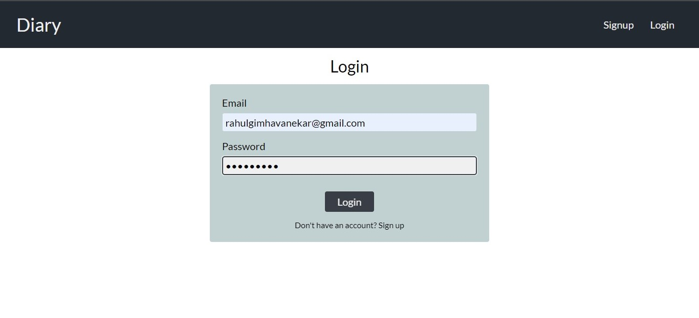
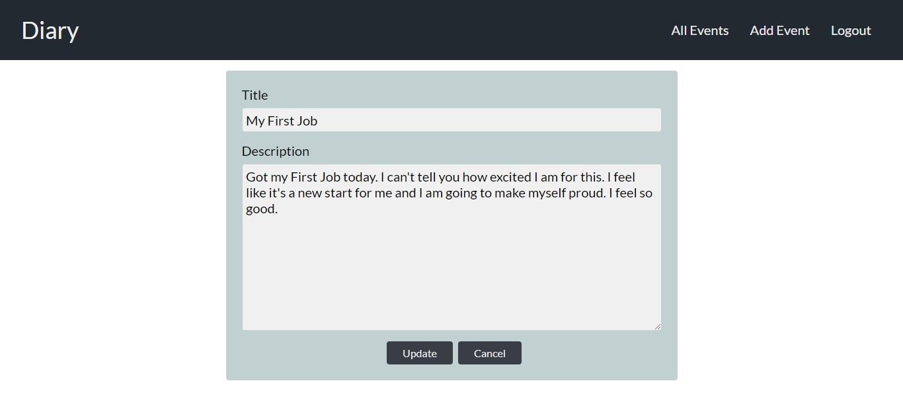

# Personal Diary app with MERN stack

The project is created using Reactjs, Nodejs, Expressjs and Mongodb. It also has authentication.

## Requirements

- Reactjs
- Nodejs

## Installation

```
cd Personal-Diary/cd client
npm install
npm start
```

#open new terminal

```
cd Personal-Diary/cd server
npm install
npm start
```

## Features

- Home Page


- Create account or Login




- Add Event


- View Event


- View All events


- Edit Event


